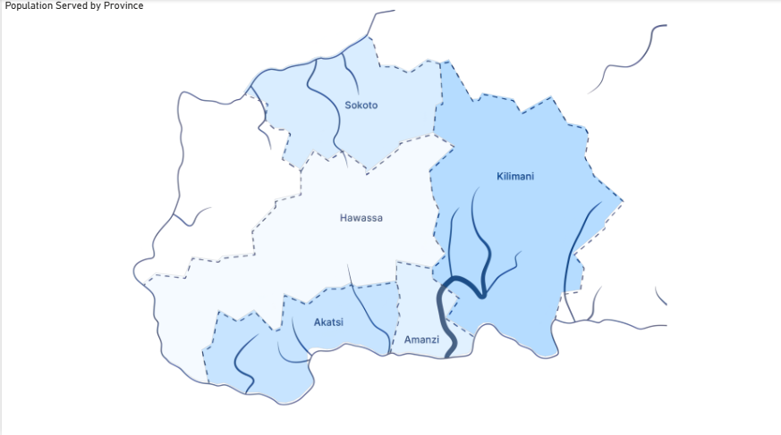
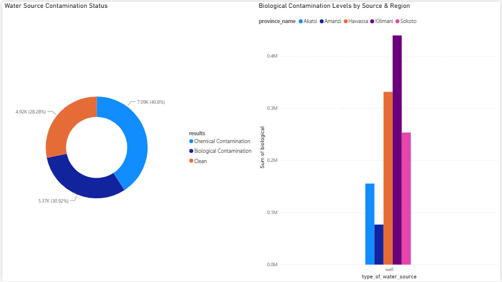
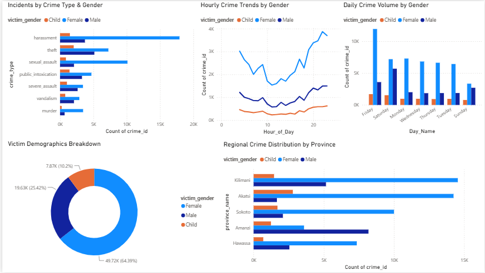
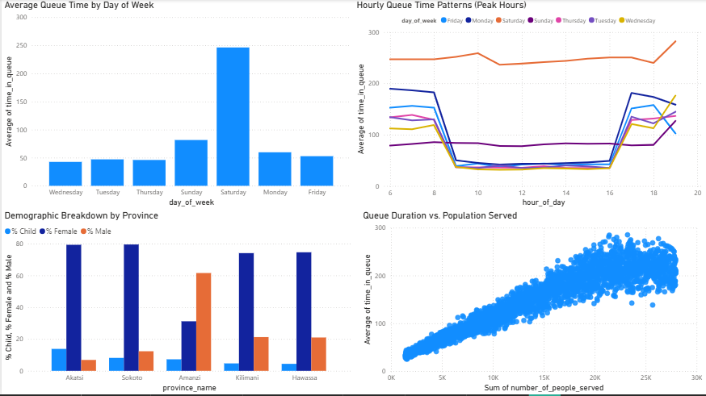

# Maji Ndogo Water Crisis: Turning 27,000+ Field Records into an Action Plan

**ALX Data Analytics Capstone** · SQL + Power BI

> Maji Ndogo is a fictional nation used in the ALX Data Analytics program to simulate a real-world water crisis. This project takes raw survey data from over 27,000 water access points and turns it into a decision-ready dashboard for national and provincial leaders.

---

## The Problem

Millions of people in Maji Ndogo don't have reliable access to clean water. Long queues at shared taps and wells aren't just an inconvenience — they cost time, expose people to unsafe water, and put women and children at risk of crime while they wait.

Leadership needed answers to three questions before they could act:
1. **Where** is water access worst, and why?
2. **Which** water sources are contaminated, and how badly?
3. **When and where** are people most at risk of crime while collecting water?

## What I Did

Starting from raw MySQL survey data, I cleaned and modeled the dataset, then built a Power BI dashboard so stakeholders could explore the crisis themselves instead of reading a static report.

- **SQL** — queried and validated the source data, joining field visits, water quality tests, and crime logs across five tables
- **Power Query (M)** — standardized inconsistent labels (e.g., `F`/`M`/`C` → `Female`/`Male`/`Child`) and cleaned whitespace/formatting issues
- **DAX** — built calculated columns and measures to classify contamination severity and roll up crime and queue metrics
- **Power BI** — designed an interactive report with drill-through by province and town

## Key Findings

**Water quality**
- ~51% of tested wells are clean; **~28% show chemical contamination** and **~21% show biological contamination**
- Sokoto and Hawassa provinces have the most severe biological contamination, making them top priorities for UV filtration and chlorine dosing

**Safety at water sources**
- Women make up the largest share of crime victims at collection points, largely due to long queues during early morning and evening hours
- Crime incidents spike between **5–8 AM** and again during evening peak queue times — a clear window for targeted security patrols

**Queue times**
- **Saturdays are by far the worst day to collect water** — average queue time jumps to ~250 minutes, roughly 3x a typical weekday
- Queues peak sharply in the early morning (before 9 AM) and again in the evening (after 4 PM), tracking directly with the crime spike windows above
- In Akatsi and Sokoto, over 75% of people in queues are women — reinforcing why queue time and public safety are the same problem, not two separate ones

*(See the dashboard screenshots below for the full picture.)*

## Where This Is Happening

Maji Ndogo has five provinces — Sokoto, Kilimani, Hawassa, Akatsi, and Amanzi — with population served, contamination, and queue burden varying widely between them.



## Dashboard Preview

| Water Insights | Crime Insights | Queue Patterns |
|---|---|---|
|  |  |  |

*Contamination breakdown by source/region, crime patterns by time of day and demographic, and queue-time trends by day and hour.*

## Try It Yourself

```bash
git clone https://github.com/silverback0/Maji-Ndogo-Water-Analysis.git
```

1. Import `sql/md_water_services.sql` into MySQL if you want to explore the raw queries
2. Open either file in `power_bi/` in Power BI Desktop to interact with the dashboards:
   - `ALX PROJECT.pbix` — Stage 1: National overview, regional map, and queue-time analysis
   - `ALX PROJECT PART 2 SCHEMA.pbix` — Stage 2: builds on Stage 1's national/queue views and adds Water Insights (contamination) and Crime Insight pages

   *Part 2 is the more complete report — start there if you only want to open one file.*

---

## Technical Deep Dive

<details>
<summary>Data model, SQL, and DAX (click to expand)</summary>

### Data Model

The project uses a star schema built from a MySQL database (`md_water_services.sql`):

```text
       +------------------+          +------------------+
       |     location     | --------<|      visits      |
       +------------------+          +------------------+
                |                             |
                |                             |
       +------------------+                   v
       |  well_pollution  | ----------------> +------------------+
       +------------------+                   |   water_source   |
                                              +------------------+
       +------------------+                            ^
       |  crime_incidents | ---------------------------+
       +------------------+
```

| Table | Contents |
|---|---|
| `location` | Province, town, urban/rural classification |
| `water_source` | Source type and population served |
| `visits` | Field survey logs (queue time, visit count) |
| `well_pollution` | Water sample test results |
| `crime_incidents` | Crime type, victim demographics, time of day |

### Example SQL

```sql
-- High-queue areas cross-referenced with contamination status
SELECT 
    l.province_name,
    l.town_name,
    ws.type_of_water_source,
    AVG(v.time_in_queue) AS avg_queue_time_mins,
    wp.results AS contamination_results
FROM visits v
JOIN location l ON v.location_id = l.location_id
JOIN water_source ws ON v.source_id = ws.source_id
LEFT JOIN well_pollution wp ON ws.source_id = wp.source_id
WHERE v.time_in_queue > 120
GROUP BY 1, 2, 3, 5
ORDER BY avg_queue_time_mins DESC;
```

### Key DAX Measures

```dax
Contamination Status = 
VAR RawResult = TRIM(Well_Pollution[results])
RETURN
SWITCH(
    TRUE(),
    RawResult = "Clean" || ISBLANK(RawResult) || RawResult = "", "Clean / Uncontaminated",
    RawResult = "Contaminated: Chemical", "Chemical Contamination",
    RawResult = "Contaminated: Biological", "Biological Contamination",
    "Clean / Uncontaminated"
)

Victim Gender Full = 
SWITCH(
    UPPER(TRIM(Crime_Incidents[victim_gender])),
    "F", "Female",
    "M", "Male",
    "C", "Child",
    "Other / Unknown"
)

Total Crime Incidents = COUNT(Crime_Incidents[crime_id])
Total Biological Contamination = SUM(Well_Pollution[biological])
```

### Repo Structure

```text
├── assets/
│   ├── 01_water_insights.png
│   ├── 02_crime_insights.png
│   ├── 03_queue_patterns.png
│   └── 04_province_map.png
├── power_bi/
│   ├── ALX PROJECT.pbix              # Stage 1: National, Regional Map, Queue Analysis
│   └── ALX PROJECT PART 2 SCHEMA.pbix # Stage 2: adds Water Insights, Crime Insight
├── sql/
│   └── md_water_services.sql
└── README.md
```

</details>

---

*Part of the ALX Data Analytics Program.*